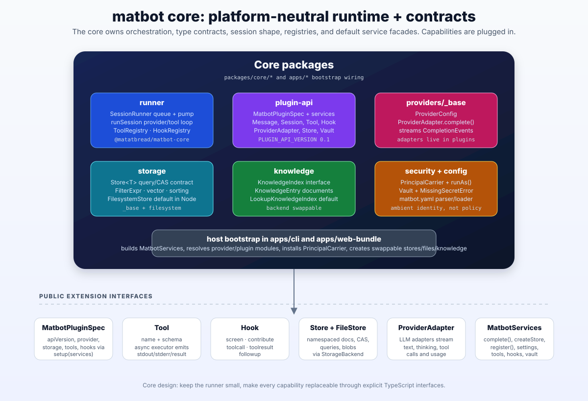
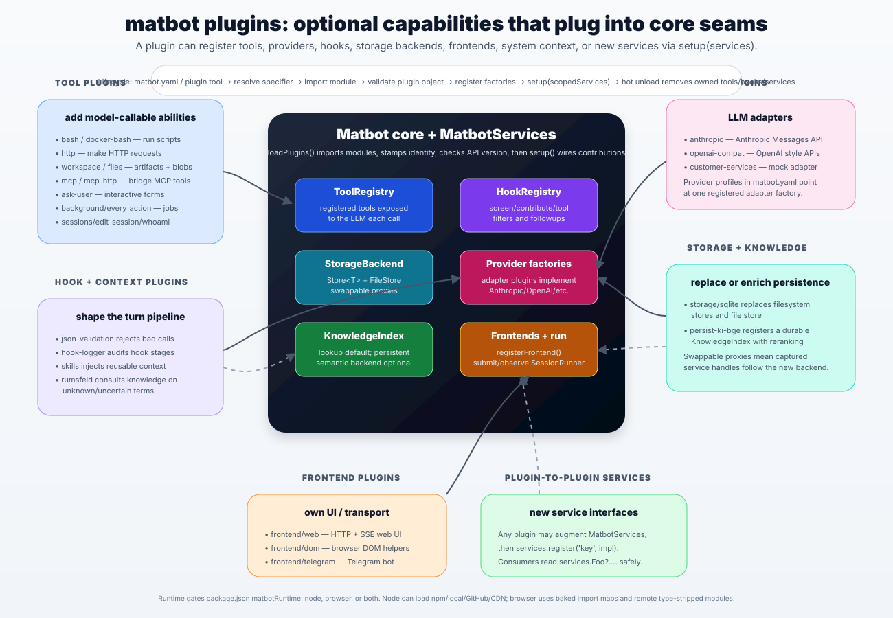
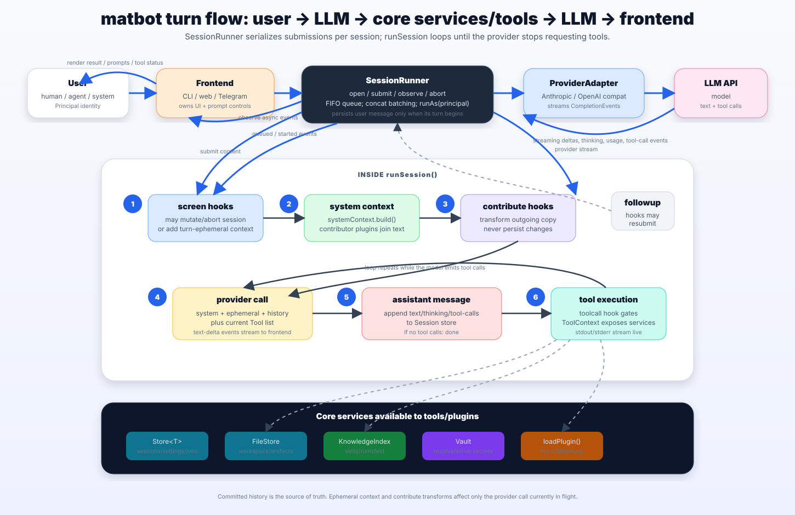

# matbot Architecture

A visual tour of how matbot fits together, in three views: the platform-neutral **core**,
the **plugins** that extend it through well-defined seams, and the **turn flow** that ties them
together at runtime. For the authoritative design principles behind these diagrams, see
[CLAUDE.md](../CLAUDE.md); for the plugin API reference, [DEVELOPING.md](DEVELOPING.md).

---

## 1. Core — the platform-neutral runtime and contracts

The core is infrastructure, not product. It owns orchestration (the `SessionRunner` queue and the
`runSession` provider/tool loop), the type contracts every plugin builds against (`MatbotPluginSpec`,
`Message`, `Session`, `Tool`, `Hook`, `ProviderAdapter`, `Store`, `Vault`), and the default service
facades. Everything concrete — LLM adapters, storage backends, knowledge indexes — is plugged in
rather than baked in. The host bootstrap (`apps/cli`, `apps/web-bundle`) is the only layer allowed to
read env/argv/yaml: it builds `MatbotServices`, resolves provider and plugin modules, installs the
`PrincipalCarrier`, and creates the swappable store/file/knowledge facades. The public extension
interfaces along the bottom — `Tool`, `Hook`, `Store`/`FileStore`, `ProviderAdapter`, `MatbotServices`
— are the entire contract a plugin author needs.

---

## 2. Plugins — optional capabilities that plug into core seams

A plugin's `setup(services)` can register tools, providers, hooks, storage backends, frontends, system
context, or entirely new plugin-to-plugin services. `loadPlugins()` imports the modules, stamps each
with an identity, checks the API version, then runs `setup()` to wire the contributions into the core
registries. The families shown — **tool** plugins (bash, http, workspace, mcp, …), **hook/context**
plugins (json-validation, skills, rumsfeld, …), **provider** adapters (anthropic, openai-compat),
**storage/knowledge** backends (sqlite, persist-ki-bge), and **frontend** plugins (web, dom, telegram)
— all attach through the same seams. Because storage and knowledge are handed out as swappable
proxies, a captured service handle keeps resolving to the current backend even after it is replaced
at runtime.

---

## 3. Turn flow — user → LLM → core services/tools → LLM → frontend

The `SessionRunner` serialises submissions per session: a FIFO queue, concat batching, and a `pump`
that runs each turn under `contextSwitch(principal)` — establishing the turn's identity *and* paging
in any machine state (a deferred `StorageBackend` swap, pending mount notifications) that was staged
while a turn was in flight. Inside `runSession()` a turn proceeds through ordered
stages — `screen` hooks may mutate or abort the session and add turn-ephemeral context; system context
is built and contributor plugins join in; `contribute` hooks transform the outgoing copy without
persisting; the provider is called with system + ephemeral + history plus the current tool list; the
assistant message (text, thinking, tool calls) is appended to the session store; and if the model
emitted tool calls, they execute (gated by the `toolcall` hook, with stdout/stderr streaming live)
and the loop repeats. Throughout, a tool reaches the services on its `ToolContext` — `Vault`,
`FileStore`, and `loadPlugin()`/`unloadPlugin()`; the broader `MatbotServices` surface (`Store`s via
`createStore`, `KnowledgeIndex`, `complete`, the registry) is what a plugin captures in its `setup()`.

